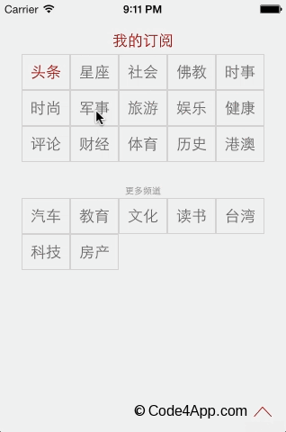

# CJNewsOrder
实现了凤凰新闻的频道订阅界面和功能，点击某个频道，可以将其移入或者移出订阅栏，剩下的频道自动重新排列。归档Model数组到本地app的Library文件夹。(参考http://code4app.com/ios/ifengNewsOrderDemo/53159e83933bf0473e8b5d08)

## Screenshots



## How to use
- ①、xxxxx的使用
```
//初始化如下：
- (void)viewDidLoad {
[super viewDidLoad];
// Do any additional setup after loading the view from its nib.
self.view.backgroundColor = [UIColor greenColor];

#pragma mark 此例中如果RBSlierVC.xib没有去掉sizeClasses，则容易出现视图无显示问题
RadioButtons_Slider *rb_slider = [[RadioButtons_Slider alloc]initWithFrame:CGRectMake(0, 100, 320, 40)];
NSArray *radioButtonNames =  @[@"Home1第一页", @"Home2", @"Home3是佛恩", @"Home4天赐的爱", @"Home5你是礼物", @"Home6"];
[rb_slider setTitles:radioButtonNames radioButtonNidName:@"RadioButton_Slider" andShowIndex:4];
[rb_slider setDelegate:self];
[self.view addSubview:rb_slider];
}

//点击时候会调用如下委托：
- (void)radioButtons:(RadioButtons_Slider *)radioButtons chooseIndex:(NSInteger)index{
NSLog(@"当前选择的是%d", index);

}
```


- ②、xxxx的使用
```

```

- ③、xxxx的使用
```

```
